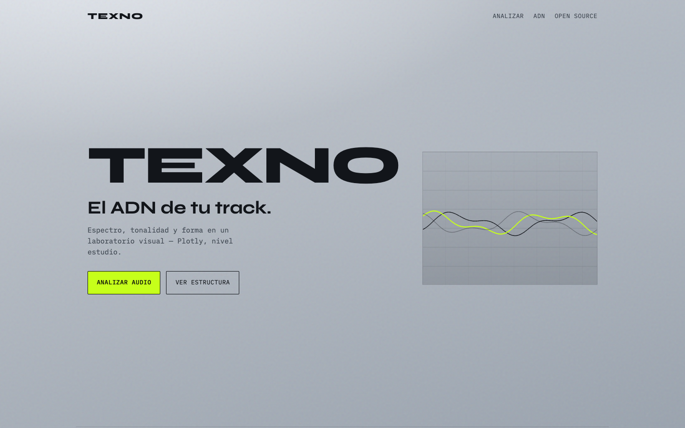
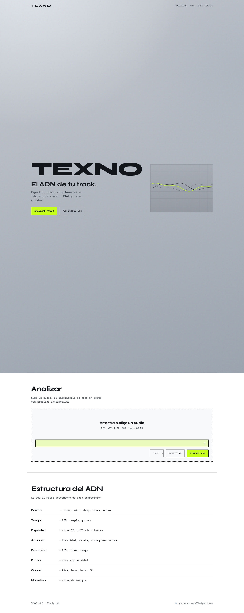
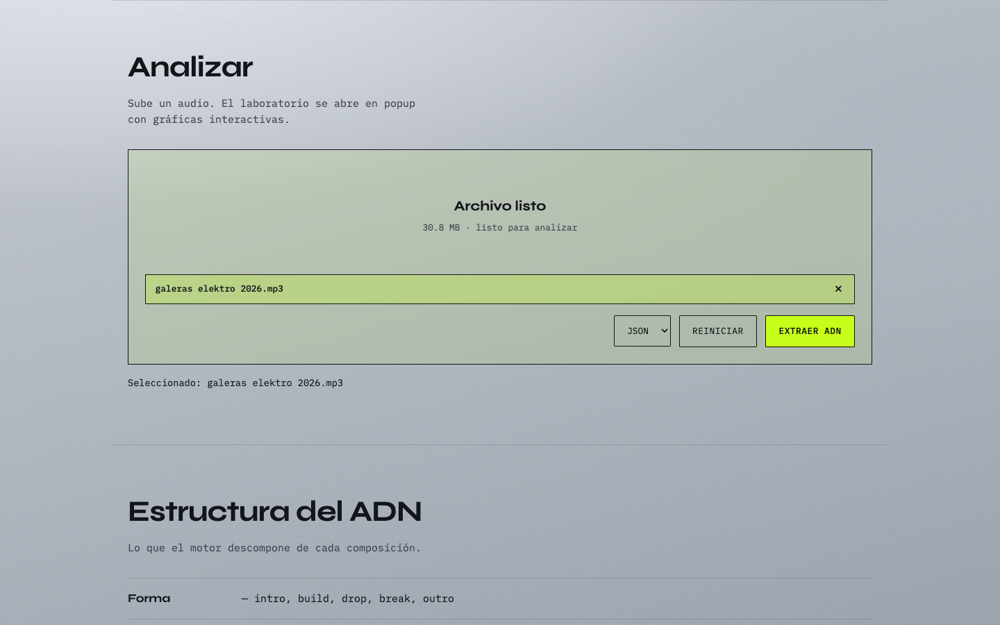
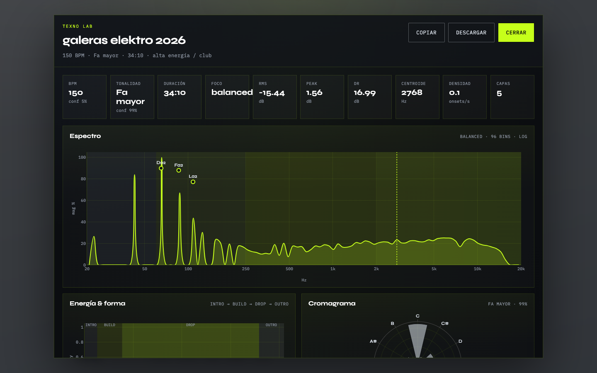
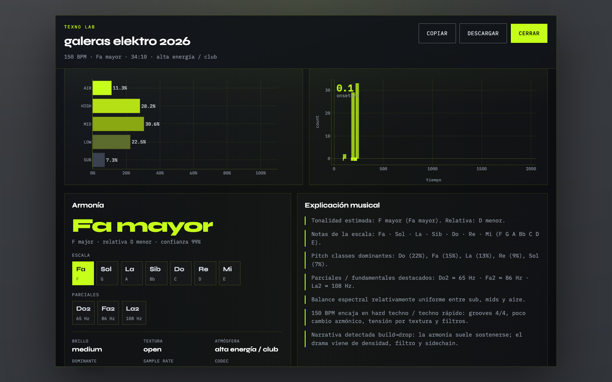
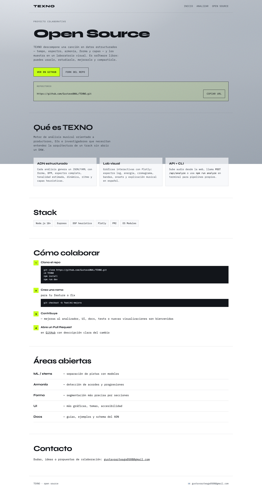
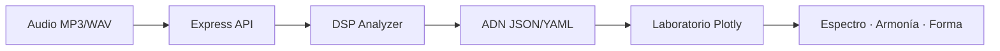

<p align="center">
  
</p>

<h1 align="center">TEXNO</h1>

<p align="center">
  <strong>Análisis estructural de composiciones musicales.</strong><br />
  Extrae el ADN de una canción — tempo, espectro, armonía, forma y capas —<br />
  y visualízalo en un laboratorio interactivo.
</p>

<p align="center">
  <a href="https://github.com/GustavoUNAL/TEXNO"></a>
  <a href="https://nodejs.org"></a>
  <a href="https://expressjs.com"></a>
  <a href="https://plotly.com/javascript/"></a>
  <a href="LICENSE"></a>
</p>

<p align="center">
  <a href="https://github.com/GustavoUNAL/TEXNO"><strong>Repositorio</strong></a> ·
  <a href="#-inicio-rápido">Inicio rápido</a> ·
  <a href="#-vista-previa">Vista previa</a> ·
  <a href="#-api">API</a> ·
  <a href="#-open-source">Colaborar</a>
</p>

---

## Qué hace

TEXNO toma un archivo de audio (MP3, WAV, FLAC, OGG…) y devuelve un **JSON/YAML estructurado** con la “firma” de la pista: lo que un ingeniero o productor necesita para entender, comparar o reconstruir una composición.

| Capa | Qué extrae |
|------|------------|
| **Forma** | intro, build, drop, break, outro |
| **Tempo** | BPM estimado, compás 4/4, confianza |
| **Espectro** | curva 20 Hz–20 kHz, bandas SUB/LOW/MID/HIGH/AIR |
| **Armonía** | tonalidad, escala, cromagrama, notas dominantes |
| **Dinámica** | RMS, peak, rango dinámico |
| **Ritmo** | onsets, densidad de eventos |
| **Capas** | kick, bass, hats, FX (heurística) |
| **Narrativa** | curva de energía y atmósfera |

> Motor **heurístico DSP** (v1) — no sustituye un DAW ni un modelo ML completo, pero entrega un ADN base sólido y reproducible.

---

## Vista previa

### Landing

<p align="center">
  
</p>

### Upload → Laboratorio Plotly

<p align="center">
  
  &nbsp;
  
</p>

### Gráficas interactivas

<p align="center">
  
</p>

<details>
<summary><strong>Ver página Open Source</strong></summary>
<br />
<p align="center">
  
</p>
</details>

---

## Inicio rápido

### Requisitos

- **Node.js 18+**
- (Opcional) [PM2](https://pm2.keymetrics.io/) para producción

### Instalación

```bash
git clone https://github.com/GustavoUNAL/TEXNO.git
cd TEXNO
npm install
```

### Desarrollo

```bash
npm run dev
```

Abre **http://localhost:3847** → sube un audio → el laboratorio se abre en popup con gráficas Plotly.

### Producción

En servidor (VPS), usa **solo PM2** — no mezcles `node src/server.js` con PM2 o verás `EADDRINUSE` en el puerto 3847.

```bash
npm install -g pm2
npm run pm2:start    # idempotente: inicia o reinicia texno
npm run pm2:logs
```

Actualizar en el VPS después de un `git pull`:

```bash
npm run vps:update
```

Si el puerto 3847 está ocupado:

```bash
pm2 list
sudo ss -tlnp | grep :3847
npm run pm2:restart
# si PM2 sigue con el puerto viejo en caché:
npm run pm2:reset
```

### HTTPS con Nginx (`texno.site`)

1. En tu DNS, apunta **texno.site** y **www.texno.site** a la IP del VPS (registro **A**).
2. Asegúrate de que TEXNO corre en PM2 (`npm run pm2:reset`).
3. En el VPS:

```bash
cd ~/projects/TEXNO
git pull
sudo CERTBOT_EMAIL=tu@email.com bash deploy/setup-texno-site.sh
```

El script instala Nginx + Certbot, obtiene el certificado Let's Encrypt y publica **https://texno.site** → `127.0.0.1:3847`.

Config manual: [`deploy/nginx/texno.site.conf`](deploy/nginx/texno.site.conf)

Si Certbot falla con **500** y menciona otra IP (ej. `2.57.91.91`):

**El DNS de texno.site apunta a más de un servidor.** Let's Encrypt valida desde varias redes; tu VPS responde bien pero la otra IP devuelve 500.

1. En tu registrador DNS, deja **solo un registro A** para `@` y `www` → IP del VPS (`curl -4 ifconfig.me`)
2. Elimina cualquier A antiguo (ej. `2.57.91.91`)
3. Si usas Cloudflare: DNS only (gris), sin proxy
4. Verifica: `dig texno.site A +short` debe mostrar **una sola IP**
5. Espera 5–15 min y vuelve a correr el setup

Diagnóstico: `sudo bash deploy/diagnose-texno-nginx.sh`

```bash
cd ~/projects/TEXNO
git pull
sudo CERTBOT_EMAIL=tu@email.com bash deploy/setup-texno-site.sh
```

---

## CLI

Analiza un track local y guarda el ADN:

```bash
npm run analyze -- ./track.mp3
npm run analyze -- ./track.mp3 --format yaml --out dna.yaml
```

---

## API

```http
POST /api/analyze?format=json
Content-Type: multipart/form-data

audio: <archivo>
```

**Respuesta:** JSON con forma, tempo, espectro, armonía, dinámica, capas y schema completo.

```bash
curl -F "audio=@track.mp3" http://localhost:3847/api/analyze
```

**Health check:** `GET /api/health`

---

## Arquitectura

```
TEXNO/
├── public/           # Landing, lab modal, Plotly UI
│   ├── index.html
│   ├── opensource.html
│   └── app.js
├── src/
│   ├── server.js     # Express + upload
│   ├── cli.js
│   └── analyzer/     # DSP + schema ADN
│       ├── dsp.js
│       ├── index.js
│       └── schema.js
└── docs/screenshots/ # Capturas para README
```



---

## Open Source

TEXNO es un **proyecto colaborativo**. Forks, issues y PRs son bienvenidos.

| | |
|---|---|
| **Repo** | https://github.com/GustavoUNAL/TEXNO |
| **Clone** | `git clone https://github.com/GustavoUNAL/TEXNO.git` |
| **Página OSS** | `/opensource.html` en local |

### Cómo colaborar

1. Fork del repositorio
2. `git checkout -b feat/mi-mejora`
3. Commit + push
4. Abre un [Pull Request](https://github.com/GustavoUNAL/TEXNO/pulls)

### Roadmap abierto

- Separación de stems (ML)
- Detección de acordes y progresiones
- Segmentación de forma más precisa
- Tests automatizados y CI
- Más visualizaciones y temas UI

---

## Scripts útiles

| Comando | Descripción |
|---------|-------------|
| `npm run dev` | Servidor con `--watch` |
| `npm start` | Producción |
| `npm run analyze -- <file>` | CLI de análisis |
| `npm run screenshots` | Regenera capturas del README |
| `npm run pm2:start` | Inicia o reinicia con PM2 (sin duplicar proceso) |
| `npm run pm2:reset` | Borra y recrea texno en PM2 (arregla puerto cacheado) |
| `npm run vps:update` | `git pull` + install + reinicio PM2 |

---

## Licencia

MIT — ver [LICENSE](LICENSE).

---

<p align="center">
  <sub>Hecho para productores, DJs e investigadores de audio.</sub><br /><br />
  <a href="https://github.com/GustavoUNAL/TEXNO" title="GitHub" style="display:inline-flex;align-items:center;justify-content:center;width:44px;height:44px;border:1px solid #12151a;text-decoration:none;margin-right:12px;">
    
  </a>
  <a href="mailto:gustavoarteaga0508@gmail.com" title="Correo" style="display:inline-flex;align-items:center;justify-content:center;width:44px;height:44px;border:1px solid #12151a;text-decoration:none;font-size:26px;">📧</a>
</p>
